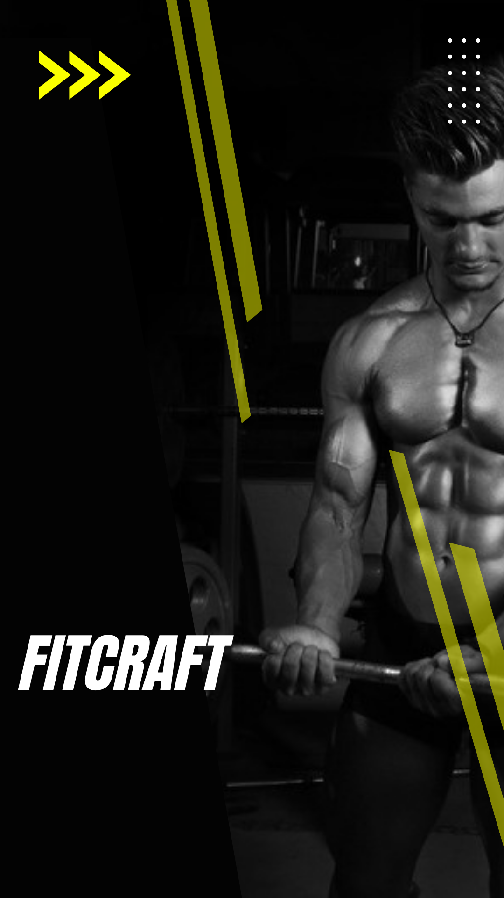
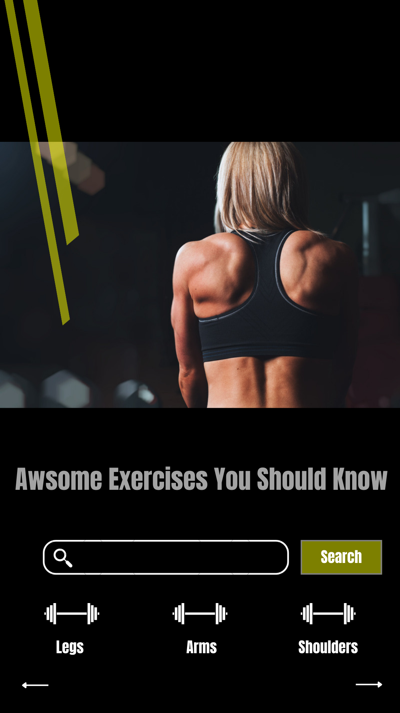
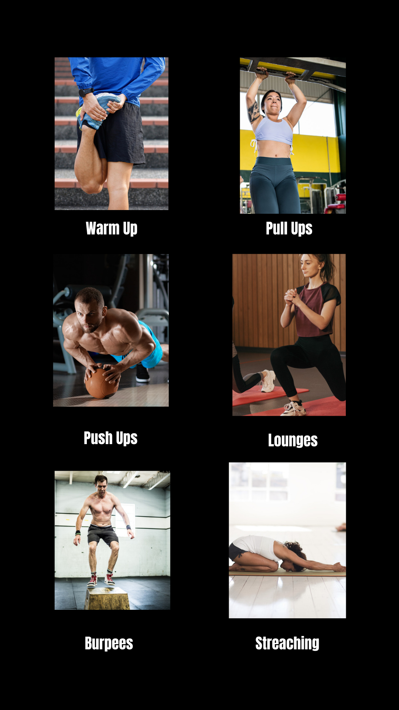

# Project Title

FitCraft

## Overview

Are you tired of generic workout routines that don't align with your fitness goals and lifestyle? Introducing FitCraft, the revolutionary web app that crafts personalized workout experiences tailored just for you.

### Problem

Many fitness apps offer one-size-fits-all solutions, leaving users feeling uninspired and disconnected from their fitness journeys. FitCraft addresses this issue by creating dynamic, customized workouts that truly cater to individual goals and needs.

### User Profile

fitcraft is an application for personal trainers, created to inspire and to help achieve your clients their fitness goal and set up a specific workout exercises.

### Features

List the functionality that your app will include. These can be written as user stories or descriptions with related details. Do not describe _how_ these features are implemented, only _what_ needs to be implemented.

## Implementation

### Tech Stack

react - react-router - axios - react - chakra ui

### APIs

Rapid API, ExerciseDB API Documentation, youtube search and download documentation

### Sitemap

I am having two pages, the first page is as the welcome page and second one is to give all detaisl about exercice and workout that will be generated by the app.

### Mockups

### Data

my data woudld be generated from an API, the first page having all design and buttons to explore the app, with serach bar to look up a workout that suit you what will be generated in second page with all details that you need.

if we decide what we want to look for we press the button search with the key word on the search bar that would generate all the exercises and workout that relate to the key word.

and if we do not have an idea on what we working on we can press on image of the muscle or workout we can have all details of the exercises that approve that specific muscle or details of the workout.

### Endpoints

I will try to make it responsive, if i have some time

### Auth

I will try to make it authentic, if i have some time

## Roadmap

- Implement Basic Components
  Build the basic structure my React components.
  Create a navigation bar, header, and footer.
  Set up routing for different views if your application is multi-page.
  Integrate API:

- Set up API endpoints and get API
  Implement logic to fetch data from the API using tools like fetch or Axios.
  Use the data from the API to dynamically render components.

- Add Form
  Implement forms for user input.

- add button and links
  all pictures are likend to a workout that been mentioned on bottom of the pictures.

## Nice-to-haves

I would like to make my application responsive.
I would like to have an extrat page for making some questions to know specificly what the client target.

FitCraft's innovative approach starts by engaging users in a personalized onboarding process. Through a series of questions about fitness objectives, preferred exercise types, and availability, FitCraft gathers the necessary information to curate a workout plan that suits your lifestyle.
